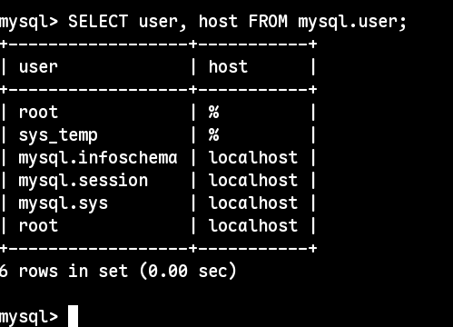
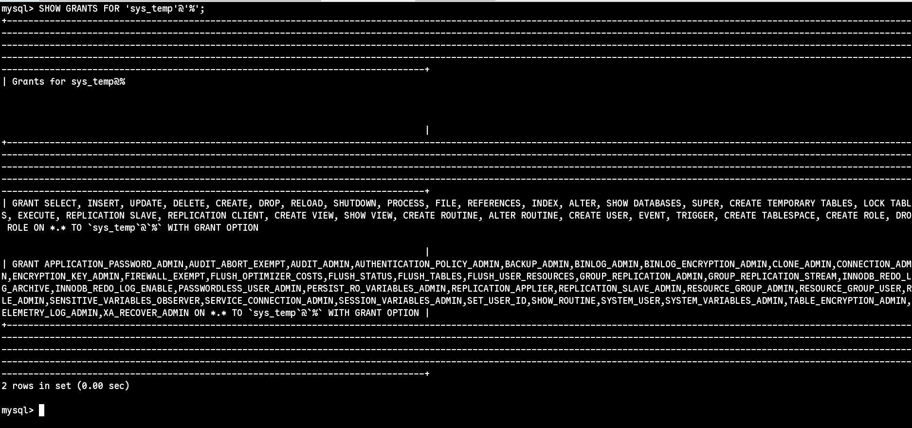
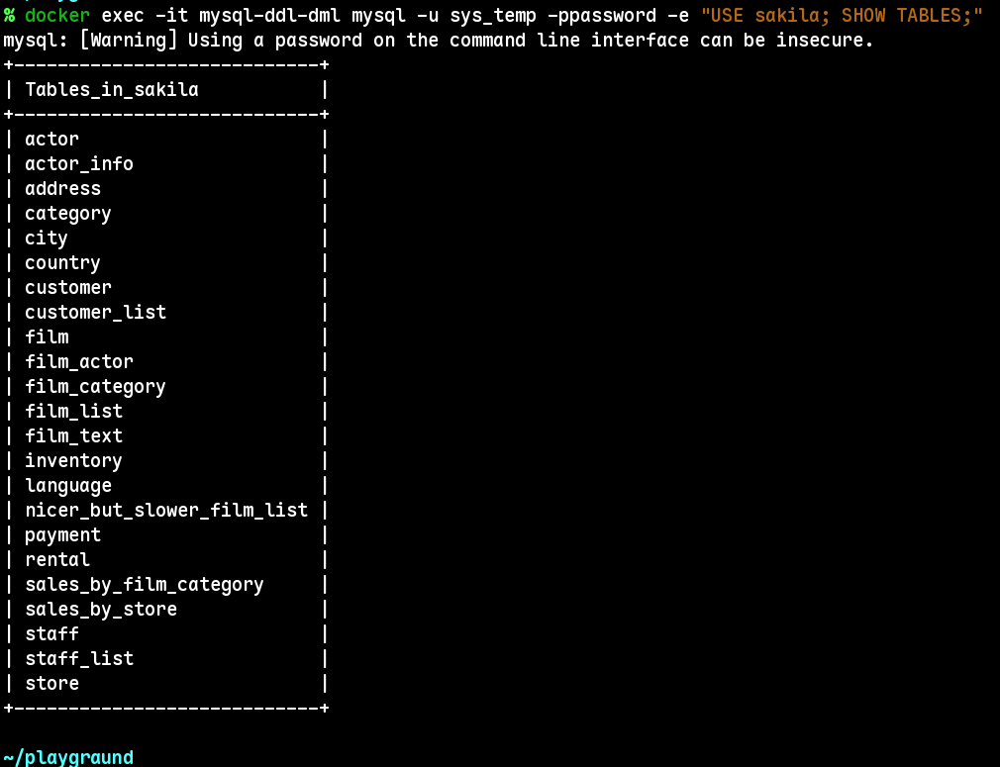
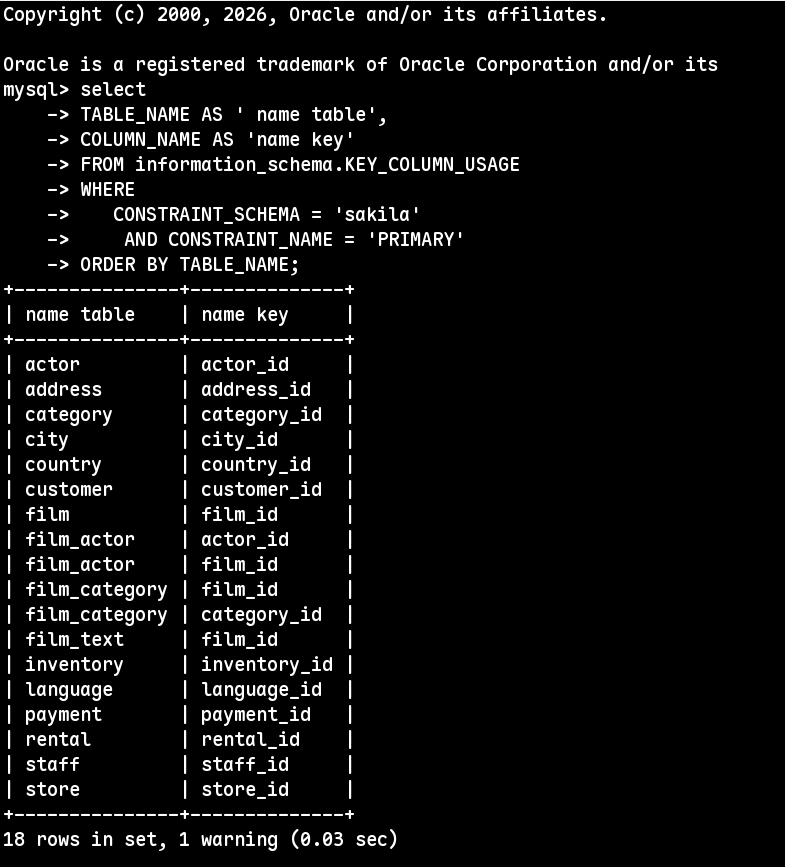

## Домашнее задание к занятию «Работа с данными (DDL/DML)» - Шаров Олег

---

## Задание 1

### 1.3. Список пользователей
Скриншот:  

### 1.5. Права пользователя sys_temp
Скриншот:  

### 1.8. Список таблиц базы sakila
Скриншот:  

---

## Выводы
1. Установлен и настроен контейнер MySQL 8.0 через Docker.
2. Создан пользователь `sys_temp` с полными правами.
3. Успешно восстановлен дамп Sakila.

## Задание 2

Список таблиц и первичных ключей:

| Название таблицы | Название первичного ключа |
|------------------|---------------------------|
| actor            | actor_id                  |
| address          | address_id                |
| ...              | ...                       |
| store            | store_id                  |

Скриншот запроса:  

